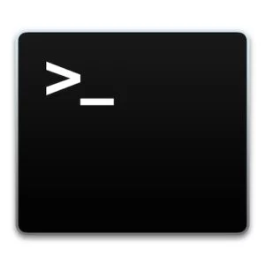

# Linux Basics & SSH

## Why Linux

In general network server or Host machine are based on Linux Operating System or OS and cost of those servers are reasonable. When the development process is over we need to host our files into the servers which are connected to the internet we need to have some level of exposure to work on the OS \(in our case Linux\) to put and handle our files. 

## Brief History  of Linux

On 25th August 1991 **Linus Torvalds** began a project that later became the [Linux kernel](https://en.wikipedia.org/wiki/Linux_kernel). _Ari Lemmke_  later in September 1991 named this project as **Linux.** In 1996 Mascot Tux was selected as official mascot of Linux. 

There are many variants of Linux are available now and are referred as distributions. [RedHat](https://en.wikipedia.org/wiki/Red_Hat), [SUSE](https://en.wikipedia.org/wiki/SUSE),  [Debian](https://en.wikipedia.org/wiki/Debian) & [Fedora](https://en.wikipedia.org/wiki/Fedora) are most known distribution of Linux.

## Linux Command Line Interface

Linux CLI is nothing but a terminal window on Linux based OS where user interact with the OS with commands per line that is why it is called Command Line Interface. 

## Linux Commands

### Basic  Commands

| Commands | Description |
| :--- | :--- |
| man | Manual for how to use commands  |
| echo | This command is used to print characters/numbers on the screen |
| pwd | Helps user to understand **P**resent **W**orking **D**irectory   |
| whoami | Helps user understand the current username |
|  uname  |  Use **uname** to show the information about the system your Linux distribution is running.  |
| ls | List contains of the directory  |
| cd | Change  directory |
| cp | Copy files from source to target directory |
| mv | Move files from source to target directory |
| mkdir | Make new directory |
| rmdir | Remove or delete directory |
| rm | Remove or delete files or directory |
| touch | Create file in directory |
| locate | Locate a file in the directory. |

### Intermediate Commands

| Command | Description |
| :--- | :--- |
| sudo | Superuser Do- When you need to issue command with superuser permission then you can use sudo along with the command. like sudo rm test.txt. |
| cat | Display the content of file. |
| df | Display the available disk space information of the mounted disks. |
| du | Display the disk usage of a file in your system |
| tar |  Use **tar** to work with tarballs \(or files compressed in a tarball archive\) in the Linux command line. |
| zip, unzip |  Use **zip** to compress files into a zip archive, and **unzip** to extract files from a zip archive. |
|  ****apt-get | Use **apt** to work with packages in the Linux command line. Use **apt-get** to install packages. This requires root privileges, so use the **sudo** command with it.  |
| chmod |  Use **chmod** to make a file executable and to change the permissions granted to it in Linux.  |

## SSH Command

Almost every Unix and Linux system includes the **`ssh`** command. This command is used to start the SSH client program that enables secure connection to the SSH server on a remote machine. The `ssh` command is used from logging into the remote machine, transferring files between the two machines, and for executing commands on the remote machine.

### Other SSH Commands

| Command | Description |
| :--- | :--- |
| ssh-keygen | Generate a key pair for public key authentication |
| ssh-copy-id | Configures a public key as authorized on a server |

> > For more details on ssh visit to [https://www.ssh.com/ssh/command](https://www.ssh.com/ssh/command)

