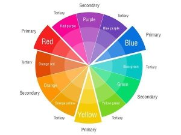
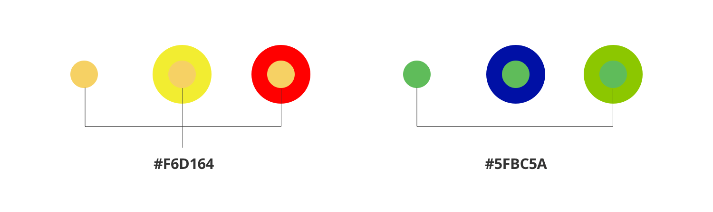
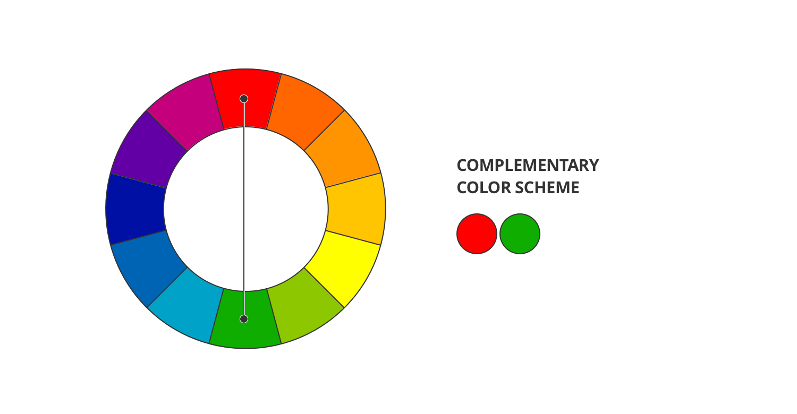
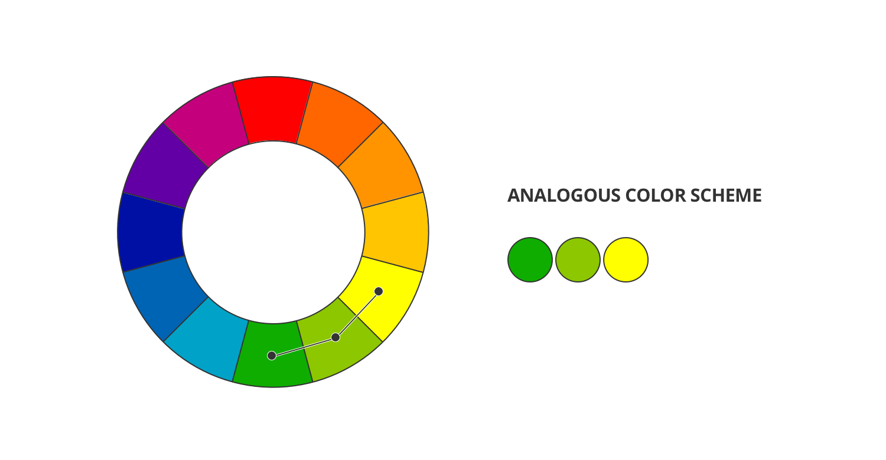
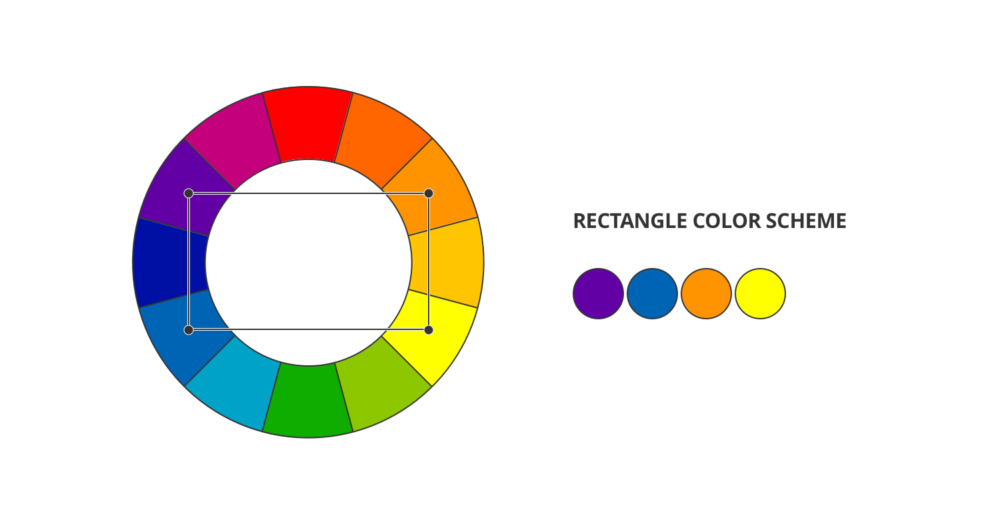

# Color Theory

## Color Wheel 

A color wheel consist of the **Primary Colors, Secondary Colors and Tertiary Colors.** 

Using the combination of the color wheel we prepare the color scheme for our projects. 


For more elaborate color theory and concepts refer to the [Canva](https://www.canva.com/colors/color-wheel/) blog.


## Color Context

Same color can create different impact to the viewers when use with different color context. So creating color schemes are tricky and hence to be in the safer side it is always better to use proven methodology of choosing color harmony to create a soothing, low contrast, high contrast etc color schemes as per the requirements.

## Color Combination/Harmonization 

### Complementary Colors 

When Opposite colors of the color wheels are considered for creating color schemes then this can be referred as complementary color combination.

###  Analogous Colors 

When colors next to others in sequence are used to create color combination then we get Analogous Color Scheme.

### Triadic Colors 

When a equilateral triangle are used on color wheel to select colors and create color scheme then this is referred as Triadic color scheme.

###  **Split-complementary**

A split-complementary scheme is a variation of the complementary scheme, but instead of using only one color as a compliment, you use two colors next to each other on the wheel to compliment your main color. By using this scheme, you create a little less tension than the complementary scheme. Because of this, it’s a good choice to start with.

### **Rectangle**

The rectangle or tetradic color scheme uses four colors arranged into two pairs of complementary colors. Because it’s made of two complementary pairs, a tetradic scheme can be overwhelmingly vibrant. If you choose to use this scheme, pick one dominant color and let the others support it.

### **Square**

The square scheme is similar to the rectangle, but all four colors are evenly spaced around the wheel…like a square. Use it like you would the rectangle scheme by choosing one dominant color and the others as support.

### Video On Color Theory Basics



