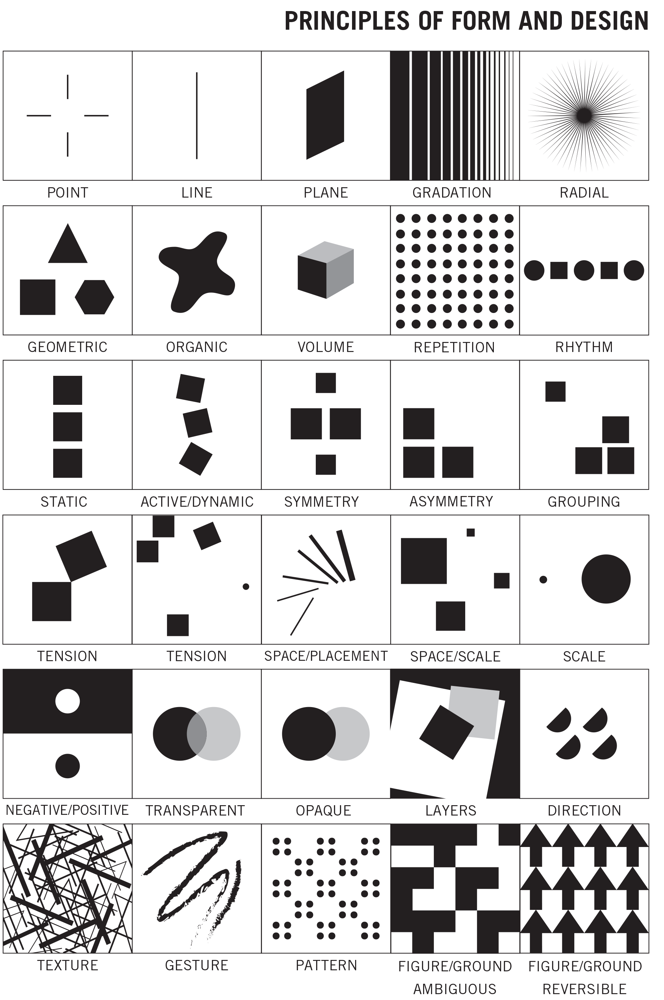
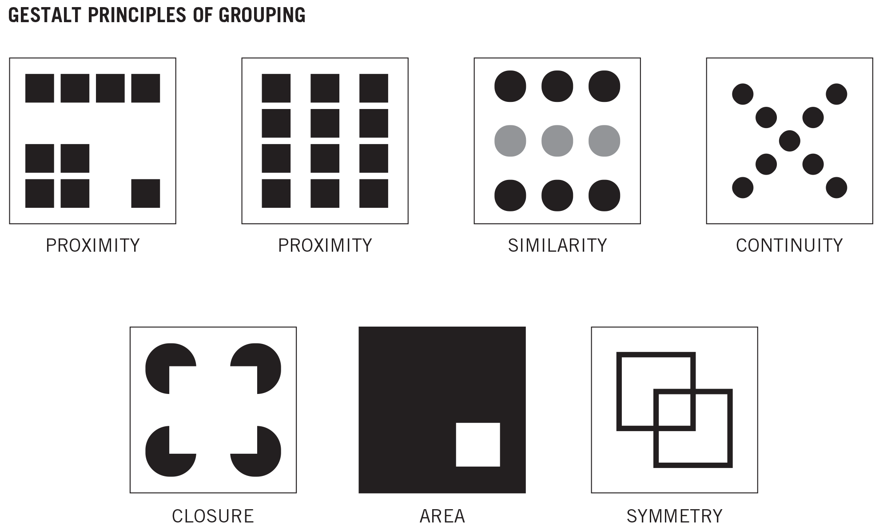

# Elements & Principals

## **Design Elements**

* **Line** – The way we treat our lines establishes a particular/dominant mood/emotion.
* **Shape** – Flat, 2D aspects of form, as opposed to volume \(think silhouette\)
* **Value/Tone** – Relative lightness or darkness
* **Texture** – Can be _actual_ or _implied_
* **Space** – Positive space is the figure/object you’re drawing; Negative space is the area AROUND the figure object you’re drawing
* **Color** – \(we won’t use color in Beginning Drawing\)

### Video On  Elements of Design



## **Design Principals**

### **Balance**

**Balance** in design is the distribution of elements of the design. **Balance is** a visual interpretation of gravity in the design. Large, dense elements appear to be heavier while smaller elements appear to be lighter. You **can balance designs** in three ways:

1. _**Symmetry**_, in which both sides of a composition have the same elements in the same position, as in a mirror-image, or the two sides of a face.
2. _**Asymmetry**_, in which the composition is balanced due to the contrast of any of the elements of art. For example, a large circle on one side of a composition might be balanced by a small square on the other side
3. _**Radial symmetry,**_ in which elements are equally spaced around a central point, as in the spokes coming out of the hub of a bicycle tire.

### **Contrast**

**Contrast** is the difference between elements of art in a composition, such that each element is made stronger in relation to the other. When placed next to each other, contrasting elements command the viewer's attention. Areas of contrast are among the first places that a viewer's eye is drawn. Contrast can be achieved by juxtapositions of any of the elements of art. Negative/Positive space is an example of contrast. Complementary colors placed side by side is an example of contrast. 

### Emphasis

**Emphasis** is when the artist creates an area of the composition that is visually dominant and commands the viewer's attention. This is often achieved by contrast.

### **Pattern**

**Pattern** is the uniform repetition of any of the elements of art or any combination thereof. Anything can be turned into a pattern through repetition. Some classic patterns are spirals, grids, weaves. ****

### Movement

**Movement** is the result of using the elements of art such that they move the viewer's eye around and within the image. A sense of movement can be created by diagonal or curvy lines, either real or implied, by edges, by the illusion of space, by repetition, by energetic mark-making. 

### **Rhythm** 

**Rhythm** is created by movement implied through the repetition of elements of art in a non-uniform but organized way. It is related to rhythm in music. Unlike pattern, which demands consistency, rhythm relies on variety.

### Video On Design Principals



## **Gestalt principles**

**Gestalt principles** or laws are rules that describe how the human eye perceives visual elements. These **principles** aim to show how complex scenes can be reduced to more simple shapes. They also aim to explain how the eyes perceive the shapes as a single, united form rather than the separate simpler elements involved.

### Video On Gestalt Principals 



