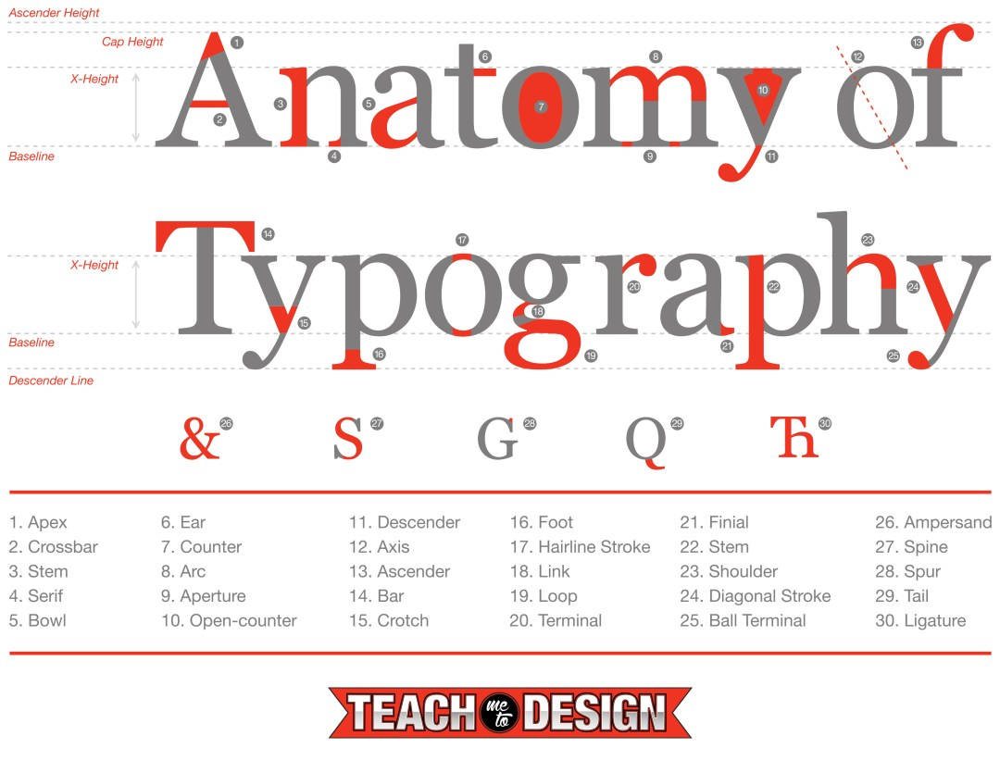

# Typography

## Type Properties

Typefaces are collection of characters or letters but each letter or character is unique and carries a shared pattern within the typeface.

Major properties are as follows:

* Baseline
* Cap-height
* X-height
* Ascenders and descenders
* Weight

## Classification of Type

### Serif

A **serif** is a small shape or projection that appears at the beginning or end of a stroke on a letter. Typeface with that have serifs are called a serif typeface. Serif fonts are classified as one of the following:

**Old-Style serifs** resemble writing in ink, with:

* Low contrast between thick and thin strokes
* Diagonal stress in the strokes
* Slanted serifs on lower-case ascenders

**Transitional serifs** have:

* High contrast between thick and thin strokes
* Medium-High x-height
* Vertical stress in the strokes
* Bracketed serifs

**Didone or neoclassical serifs** have:

* Very high contrast between thick and thin strokes
* Vertical stress in the strokes
* “Ball” terminal strokes.

**Slab serifs** have:

* Heavy serifs with imperceptible differences between the stroke weight
* Minimal or no bracketing

### Sans Serif

A typeface without serifs is called a sans serif typeface, from the French word “sans” that means "without." Sans serifs can be classified as one of the following:

* **Grotesque:** Low contrast between thick and thin strokes, vertical or no observable stress
* **Humanist:** Medium contrast between thick and thin strokes, slanted stress
* **Geometric:** Low contrast between thick and thin strokes, with vertical stress, and circular round forms

### Monospace or Samewidth

Monospace typefaces display all characters with the same width.

## Further Reference on Typography

### Detail Anatomy of typeface

### Video on Anatomy of Typography



### Video on Communicating with Typography



